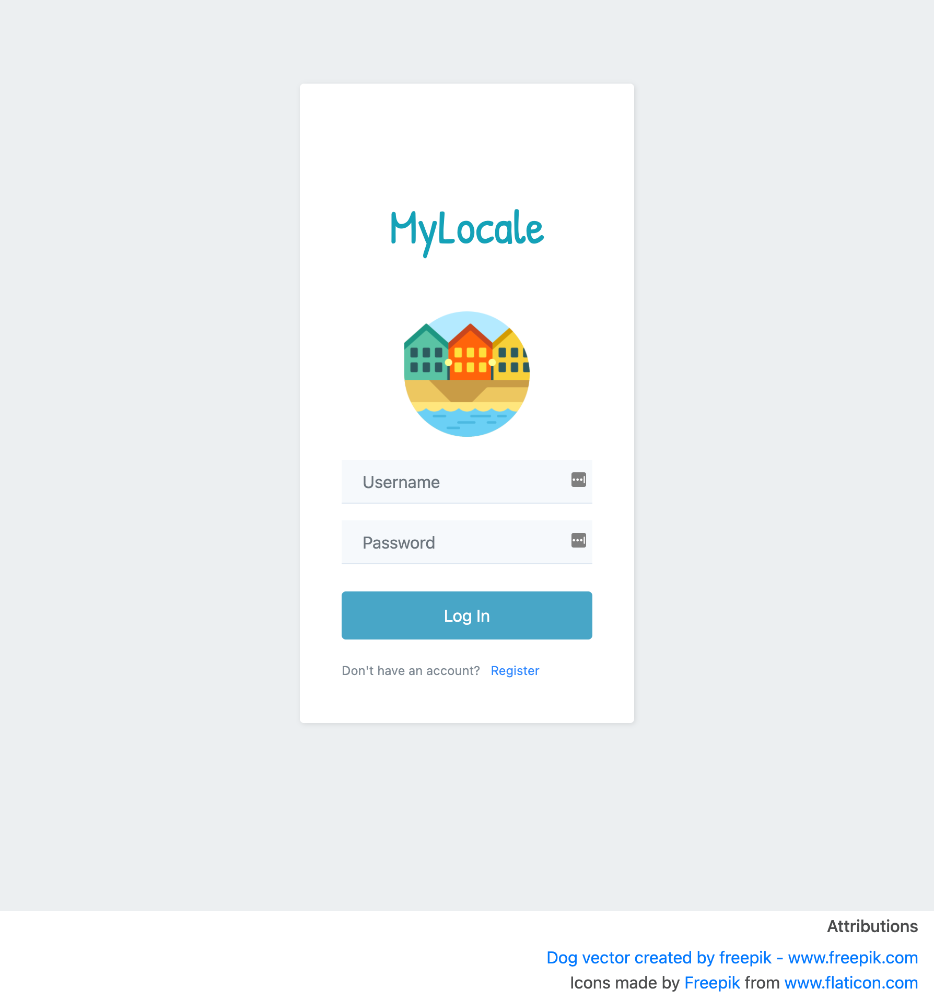
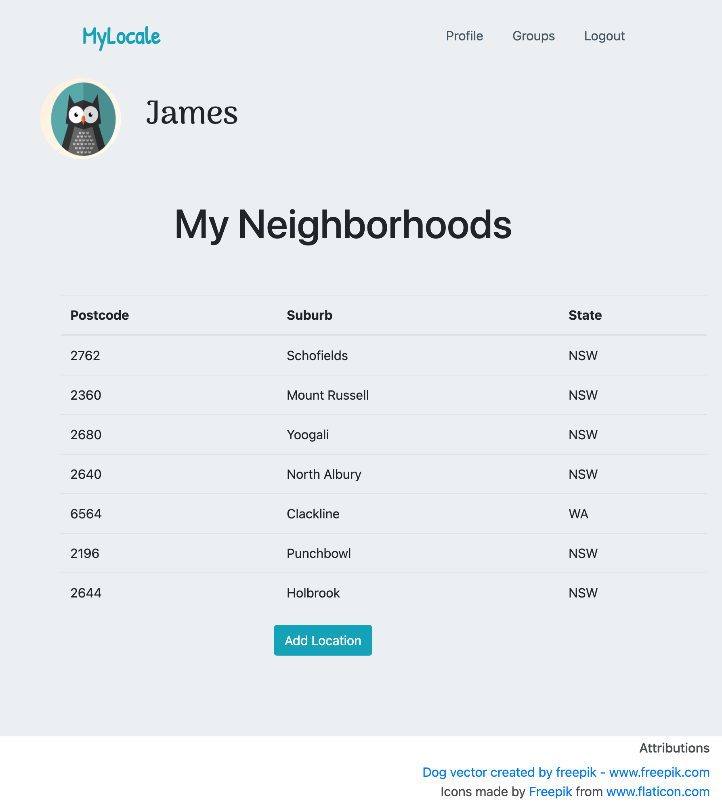
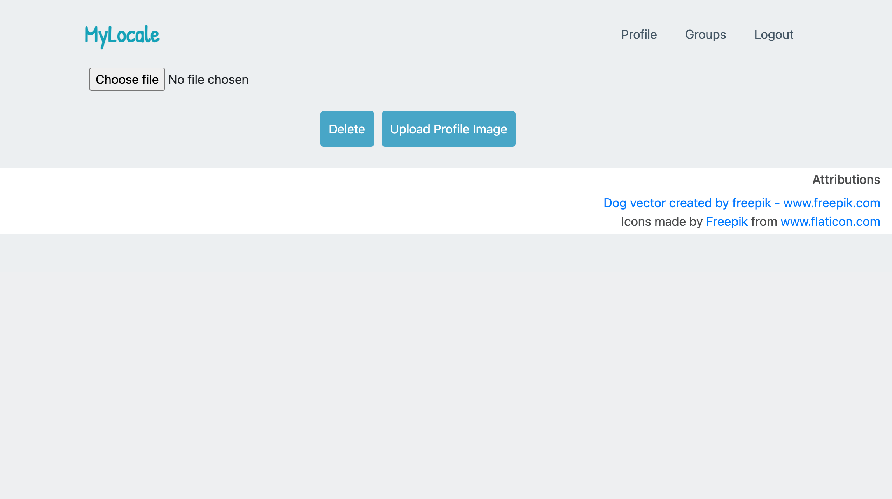
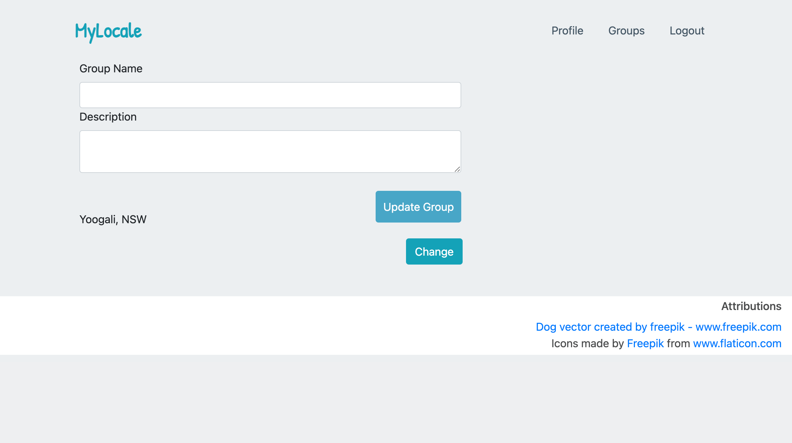
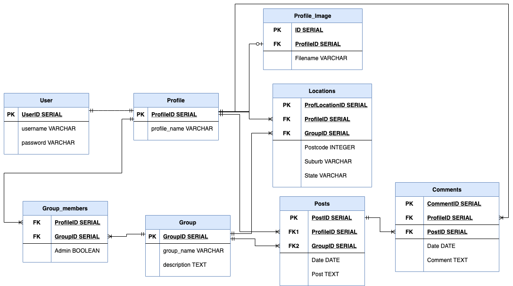
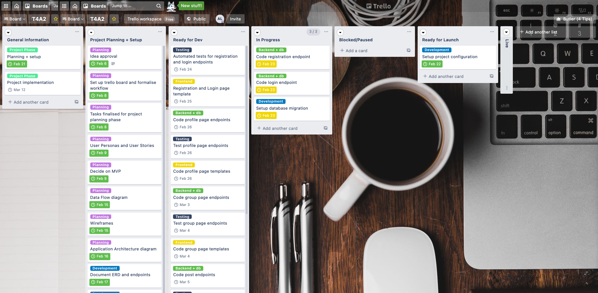

# PART B DOCUMENTATION
## PROJECT REQUIREMENTS

# R11: Deployed Website
URL: https://mylocale.ml/web/login
MyLocale is built as a responsive website with the following pages.

**Registration page**

Registration page for user registration

**Login page**

User login page

**Profile page**

User profile page showing profile details and locations

**Profile name page**

Newly registered users will be prompted to enter a profile name upon first login.

**Upload profile photo page**

Page for users to upload or delete their profile photo.

**Add location page**

Location search page that prompts users to enter a postcode which is then searched against an external API (PostcodeAPI) to return matching location(s) for user to add to their profile.

**Groups page**

Groups page showing a list of groups which a user is admin/member of and a group recommendation section which shows groups that have postcodes matching user's profile postcodes. Options shown differs between group admin and members. Non-group members are given the option to join groups in the group recommendation section.

**Create group page**

Page for group creation whereby user will be prompted to enter a postcode which does a location search (through external API) before filling up the group details(shown). List of locations are the results returned from the API search.

**Update group page**

Page for group admin to update group details and/or location.

**Search group page**

Groups can be looked up by keyword or postcode. Keyword searches.

**Group details page**

Group details page showing group details and posts related to that group by members of the group. This page is available to all logged in users (not just members of the group). Posts and related comments are shown as a unit whereby comments are indented.

**Create post page**

Page for group member/admin to create a new post for the group

**Update post page**

Page for originer author of post to update their post

**Create comment page**

Page for group members to comment against a group post.

## R13: PART A Documentation (Updated)
The updated submission for Part A can be found [here](docs/PartA_submission.md).

This documentation submitted as part of the planning phase (Part A) has been updated in the following sections:-

1. Project description - updated terminology from pages to groups to avoid confusion.
2. Architecture Diagram - Now includes the architecture diagram of the application as deployed in AWS + description of the deployment architecture.
3. Statement confirming the non-implementation of planned additional features (account management page).

## R1: PROJECT CODE

This project is coded using Python's flask framework following the Model-View-Controller(MVC) pattern and connects to a database using SQLAlchemy ORM as well as SQLAlchemy-Marshmallow for data serialisation/deserialisation. The project source code is located [here](src) organised into the following files/folders:-

* [controllers](src/controllers) - contains the controllers for all endpoints in the web application. 
* [migrations](src/migrations) - contains scripts necessary for database migration.
* [models](src/models) - contains sqlalchemy models for building database tables
* [schemas](src/schemas) - contains sqlalchemy-marshmallow schemas for serialisation and deserialisation of data
* [templates](src/templates) - Jinja2 templates (view component) to be rendered in HTML and CSS on the website.
* [tests](src/tests) - automated tests for integration testing of routes and views.
* [.env.example](src/.env.example) - template for the creation of the .env file with required environment variables for the application to run.
* [commands.py](src/commands.py) - custom flask commands for dropping, creating and seeding of database tables
* [default_settings.py](src/default_settings.py) - flask configuration settings for different flask environments. 
* [forms.py](src/forms.py) - forms coded using WTForms to collect user input from the front end (web application) and sent securely to the intended endpoints for processing.
* [main.py](src/main.py) - flask application initialisation code written in the factory pattern.
* [requirements.txt](src/requirements.txt) - list of application dependencies to be installed using `pip install -r requirements.txt`

R2:
R3:
R4:
R5:
R6:
R7:
R8:
R9:
R11:
R12:

## Entity Relationship Diagram(ERD)

The above Entity Relationship Diagram(ERD) outlines the database structure that is set up for the MyLocale web application.

## Project Management (Trello)
This section is a continuation of the project tracking activity from PART A-R6. Below are the screenshots of the Trello board throughout the application development and deployment process.

*February 22*: Tasks finalised, development commenced. App will be built by pages starting with the back-end and database followed by front-end templates to ensure all features are developed in a timely manner. Due to low confidence in developer's front-end skill, the app development is conducted in stages and aims to enhance the developer's knowledge of the front end as each stage is built and not leaving the least certain part of the development to a later date.

*February 23*: Completed and tested registration and login endpoints and templates. Initial database migration implemented.

*February 26*: Completed backend, db and frontend for profile page. Implemented some changes to the original plan for the profile page to complement logic. Testing delayed.

*Mar 2*: Profile page testing completed. Group page backend development under way. Completed 3 group page endpoints.

*Mar 3*: Completed coding group page endpoints and templates. Testing under way.

*Mar 4*: Group page testing delayed due to difficulties seeding test db for group page endpoint testing and code refactoring. Development and testing of content page delayed by a day.

*Mar 5*: Group page testing complete. Content page coding under way.

*Mar 6*: Backend and template development and testing completed. Moved due date for front end and deployment to allow for a little more time on front end styling.

*Mar 8*: Frontend styles completed. MVP completed and ready to be deployed. Allowed an extra day for deployment as most tests are already covered in automated tests.

*Mar 10*: Successfully deployed application into AWS using ECS. Manual testing underway.

## Deployment/Installation steps
### Continuous integration/Continuous Deployment(CI/CD)

**Continuous Integration(CI)**

The YAML file detailing Continuous Integration/Continuous Deployment workflows can be found here: [CI/CD workflow](.github/workflows/ci-cd.yml).

The steps involved in the Continuous Integration(CI) workflow upon pushing onto GitHub:-
1. Checks out project from github into a virtual machine(VM) running on ubuntu-latest.
2. Installs Python3.8 on the VM
3. Installs dependencies as specified on requirements.txt
4. Run Automated tests
5. Checks code according to PEP8 style guide using flake8

**Continuous Deployment(CD)**
<!-- Pending deployment -->

## Endpoint documentation
**Web endpoints**

Endpoints are documented in the formats below. These do not subscribe to the RESTful convention due to restrictions on methods such as PUT, PATCH and DELETE on web browsers:

* [Raw format](docs/web_endpoints.yml)
* [Swagger viewer](https://petstore.swagger.io/?url=https://raw.githubusercontent.com/ashley190/T4A2/main/docs/web_endpoints.yml)

**API endpoints**
API endpoints following restful conventions are documented in the formats below:-

* [Raw format](docs/api_endpoints.yml)
* [Swagger viewer](https://petstore.swagger.io/?url=https://raw.githubusercontent.com/ashley190/T4A2/main/docs/api_endpoints.yml)
