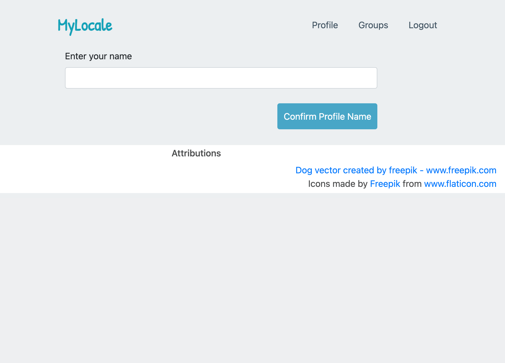
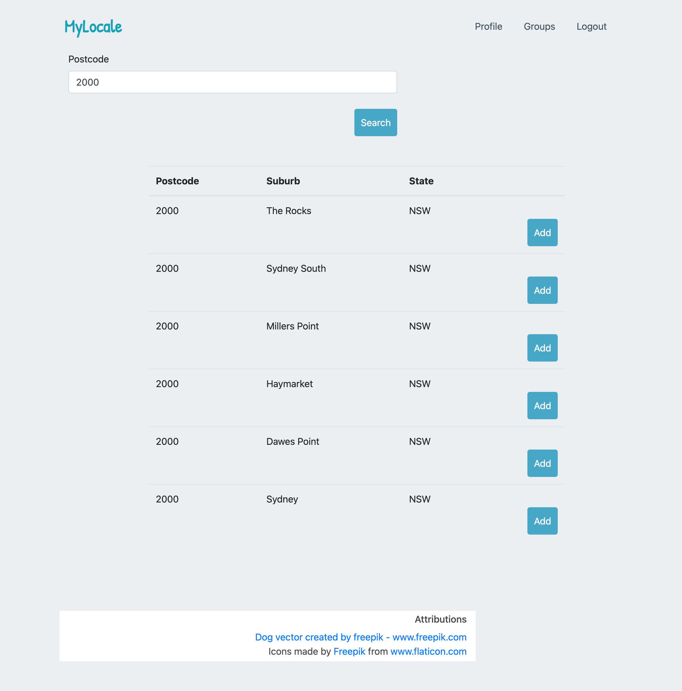
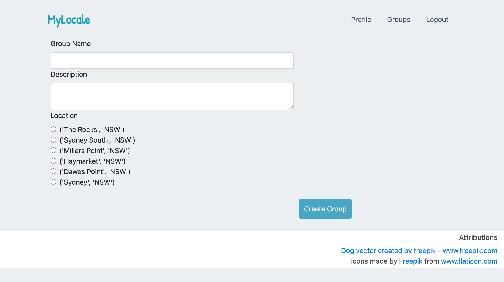
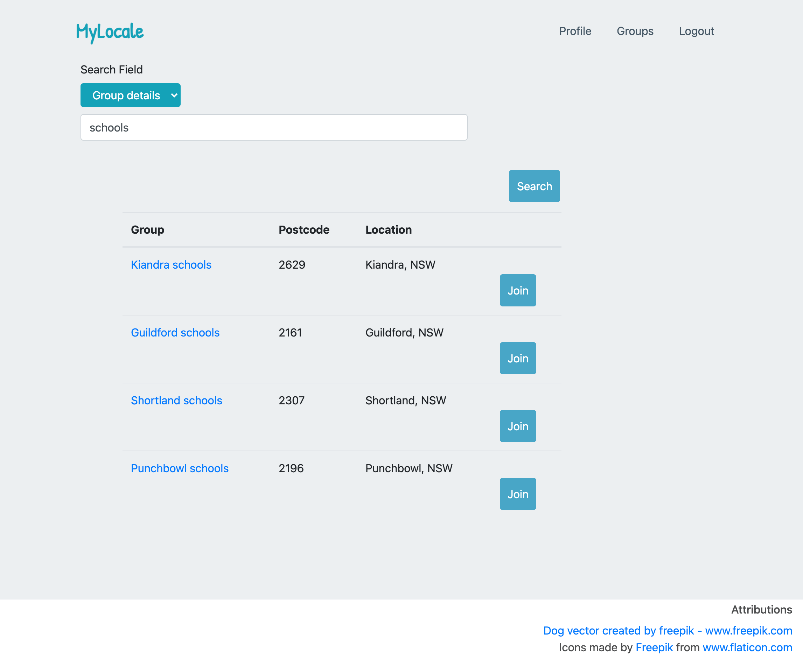
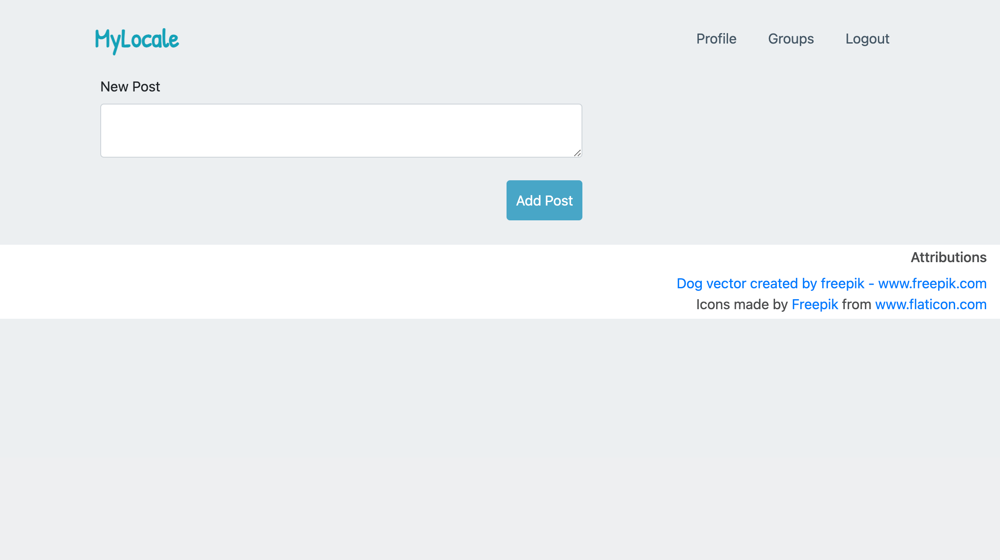
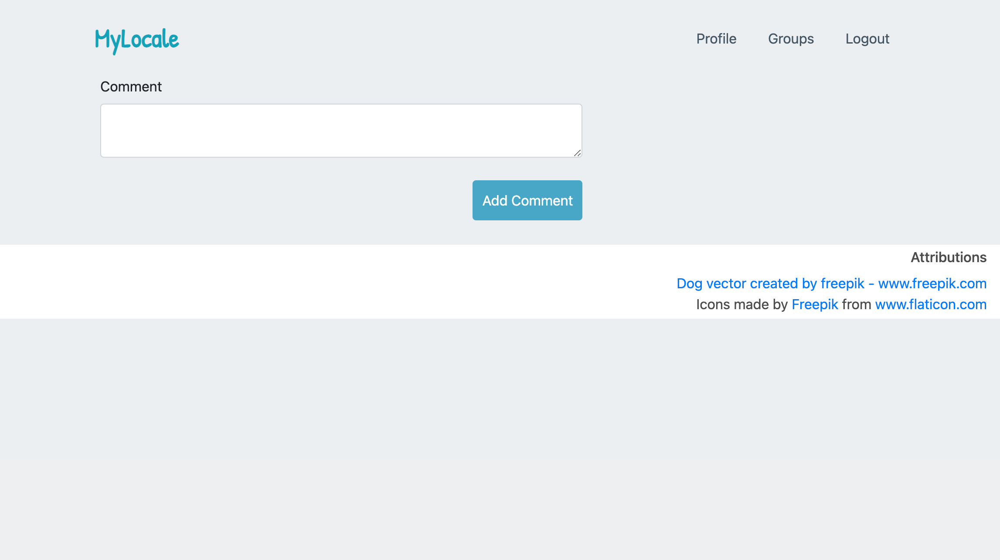
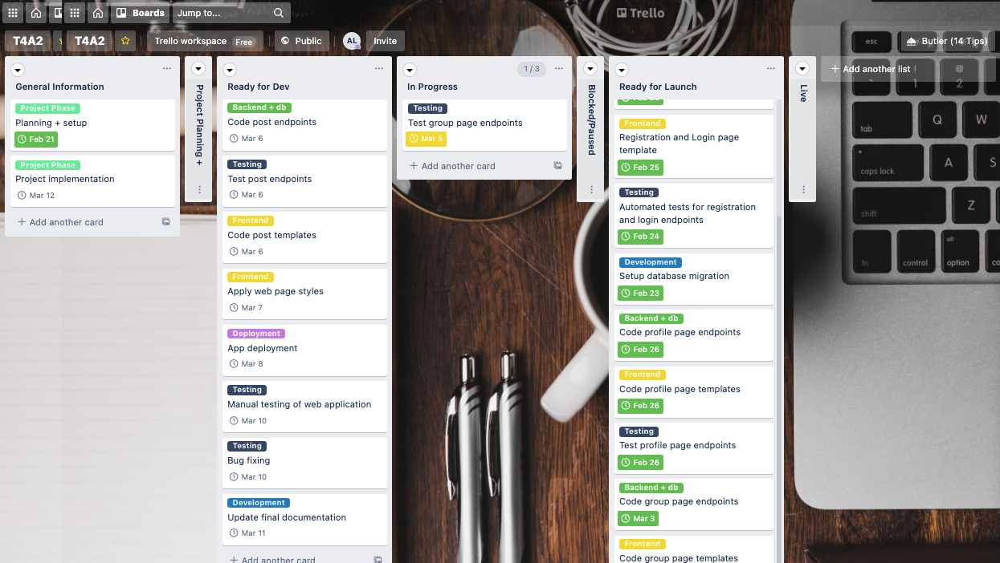
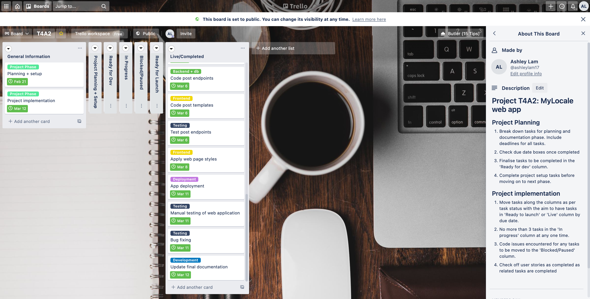
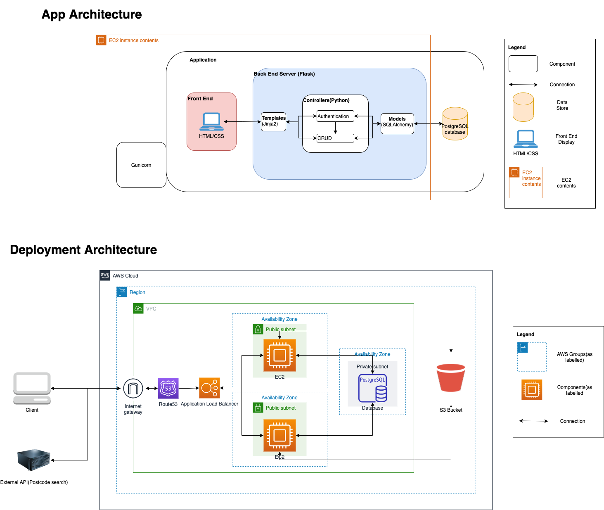

# PART B DOCUMENTATION
## PROJECT REQUIREMENTS

# R5, R7, R11: Deployed Website
**URL**: https://mylocale.ml/web/login

MyLocale is the resulting website built from the user stories and planned features from the project planning phase ([Part A](docs/PartA_submission.md)). 

All MVP features were implemented as per planned in part A. Additional feature(s) planned were not implemented due to time constraints.

MyLocale is built as a responsive website with the following pages.

**Registration page**

Registration page for user registration

**Login page**

User login page

**Profile page**

User profile page showing profile details and locations

**Profile name page**

Newly registered users will be prompted to enter a profile name upon first login.

**Upload profile photo page**

Page for users to upload or delete their profile photo.

**Add location page**

Location search page that prompts users to enter a postcode which is then searched against an external API (PostcodeAPI) to return matching location(s) for user to add to their profile.

**Groups page**

Groups page showing a list of groups which a user is admin/member of and a group recommendation section which shows groups that have postcodes matching user's profile postcodes. Options shown differs between group admin and members. Non-group members are given the option to join groups in the group recommendation section.

**Create group page**

Page for group creation whereby user will be prompted to enter a postcode which does a location search (through external API) before filling up the group details(shown). List of locations are the results returned from the API search.

**Update group page**

Page for group admin to update group details and/or location.

**Search group page**

Groups can be looked up by keyword or postcode. Keyword searches for matching words in group name, group description and/or group location. Search results will only show groups where user is not a member.

**Group details page**

Group details page showing group details and posts related to that group by members of the group. This page is available to all logged in users (not just members of the group). Posts and related comments are shown as a unit whereby comments are indented.

**Create post page**

Page for group member/admin to create a new post for the group

**Update post page**

Page for originer author of post to update their post

**Create comment page**

Page for group members to comment against a group post.

# R13: PART A Documentation (Updated)
The updated submission for Part A can be found [here](docs/PartA_submission.md).

This documentation submitted as part of the planning phase (Part A) has been updated in the following sections:-

1. Project description - updated terminology from pages to groups to avoid confusion.
2. Architecture Diagram - Now includes the architecture diagram of the application as deployed in AWS + description of the deployment architecture.
3. Statement confirming the non-implementation of planned additional features (account management page).

# R1: PROJECT CODE

This project is coded using Python's flask framework following the Model-View-Controller(MVC) pattern and connects to a database using SQLAlchemy ORM as well as SQLAlchemy-Marshmallow for data serialisation/deserialisation. The project source code is located [here](src) organised into the following files/folders:-

* [controllers](src/controllers) - contains the controllers for all endpoints in the web application. 
* [migrations](src/migrations) - contains scripts necessary for database migration.
* [models](src/models) - contains sqlalchemy models for building database tables
* [schemas](src/schemas) - contains sqlalchemy-marshmallow schemas for serialisation and deserialisation of data
* [templates](src/templates) - Jinja2 templates (view component) to be rendered in HTML and CSS on the website.
* [tests](src/tests) - automated tests for integration testing of routes and views.
* [.env.example](src/.env.example) - template for the creation of the .env file with required environment variables for the application to run.
* [commands.py](src/commands.py) - custom flask commands for dropping, creating and seeding of database tables
* [default_settings.py](src/default_settings.py) - flask configuration settings for different flask environments. 
* [forms.py](src/forms.py) - forms coded using WTForms to collect user input from the front end (web application) and sent securely to the intended endpoints for processing.
* [main.py](src/main.py) - flask application initialisation code written in the factory pattern.
* [requirements.txt](src/requirements.txt) - list of application dependencies to be installed using `pip install -r requirements.txt`

# R2, R12: GitHub and Source control

**GitHub**: https://github.com/ashley190/T4A2

Source control is implemented using Git and Github. All work is pushed to main branch and feature branches in stages. Each feature has a branch (not deleted) although feature has already be completed and merged into the main branch. A capture of the history of commits and branches used is visualised [here](docs/source_control.txt). This is captured in the afternoon on Mar 12.

# R3, R4: Project Management and task delegation

Trello board: https://trello.com/b/awN6ojS8/t4a2

Project workflow was followed as described in [Part A submission](docs/PartA_submission.md). This project is implemented using the Kanban methodology using Trello. Tasks are updated at the end of each day/each task on the board. Each task is labelled to signify a different aspect of the project (task delegation) and assigned a due date. Some dates were moved during the implementation as tasks are taking longer/shorter than expected to complete. Below are some trello board screenshots throughout the project implementation phase as a follow on from the project planning phase:-

*February 22*: Tasks finalised, development commenced. App will be built by pages starting with the back-end and database followed by front-end templates to ensure all features are developed in a timely manner. Due to low confidence in developer's front-end skill, the app development is conducted in stages and aims to enhance the developer's knowledge of the front end as each stage is built and not leaving the least certain part of the development to a later date.

*February 23*: Completed and tested registration and login endpoints and templates. Initial database migration implemented.

*February 26*: Completed backend, db and frontend for profile page. Implemented some changes to the original plan for the profile page to complement logic. Testing delayed.

*Mar 2*: Profile page testing completed. Group page backend development under way. Completed 3 group page endpoints.

*Mar 3*: Completed coding group page endpoints and templates. Testing under way.

*Mar 4*: Group page testing delayed due to difficulties seeding test db for group page endpoint testing and code refactoring. Development and testing of content page delayed by a day.

*Mar 5*: Group page testing complete. Content page coding under way.

*Mar 6*: Backend and template development and testing completed. Moved due date for front end and deployment to allow for a little more time on front end styling.

*Mar 8*: Frontend styles completed. MVP completed and ready to be deployed. Allowed an extra day for deployment as most tests are already covered in automated tests.

*Mar 10*: Successfully deployed application into AWS using ECS. Manual testing underway.

*Mar 12*: Application testing and deployment complete. Finalising documentation for submission.

*Mar 12 (end of day)*: Documentation completed. Ready for submission.

# R6: Deployment to a cloud hosting service

This app is deployed onto AWS. Two different approaches were made in deployment:-

1. Using Docker and ECS
Initially the application was deployed onto AWS using ECS. The Deployment section of the [Continuous Integration/Continuous Deployment (CI/CD)](.github/workflows/ci-cd.yml) workflow was written and works for the ECS deployment. However, upon manual testing of the application, major issues were found with the web application that is causing major features to break due to the EC2 instances not being able to communicate externally to the API and S3 bucket. Due to the major issues not being able to be resolved in time for submission, this deployment was taken down to be attempted at developer's individual time in the future. 

2. Manual deployment
The developer ended up with manual deployment with deploying separate components of the following architecture individually. This was successfully implemented with DNS and HTTPS successfully deployed for the web application. Below is the Cloud architecture diagram for this deployment (under the Deployment architecture section). 

# R8, R9: Testing

Two types of testing were done during this phase of the project.

## Automated testing
Automated tests are written as the coding of each feature/page was completed. This was to ensure that functional high quality code was pushed up to GitHub as part of the [Continuous Integration workflow](.github/workflows/ci-cd.yml). All automated tests can be found in the [tests](src/tests) folder with separate test codes written for separate controllers. The helpers file contain the test case classes with the setUp, tearDown and common methods used across all test codes. Each endpoint has an automated tests that tests for the following:-
* Correcly rendered pages and forms for endpoints that have rendered pages
* Data persistence as requests are sent to endpoints that process data
* Data being reflected correctly in the view model resulting in an accurate front end.

## Manual testing
Manual testing was done by after the ECS deployment and has been recorded in the [manual testing sheet](docs/manual_testing.pdf). This sheet reflects manual test scenarios for all pages, the test action, the expected and actual results as well as a Pass/Fail status. This was where the issue with the app not being able to communicate externally through the ECS deployment was found (See IDs - 33, 34, 36, 37, 45, 46, 53, 54).

# Additional documentation

## Installation steps
This app can be downloaded and installed locally using two methods:-

### **Approach 1: Manually clone, install and run app on local machine**

1. Git clone project from GitHub. 

    `git clone https://github.com/ashley190/T4A2.git`

2. Install Python3.8, Python3-pip and python3.8-venv in your local machine.

    `sudo apt-get install python3.8 python3.8-venv python3-pip`

3. Change directory into T4A2 folder and initialise the Python virtual environment.

    `python3.8 -m venv venv`

4. Change directory into the src directory and install dependencies.

    `pip install -r requirements.txt`

5. Create a .env file in the src folder and populate the variables as indicated in the .env.example file.

**Set up database(PostgreSQL as example)**

6. Install and setup PostgreSQL on your machine. 

    `sudo apt-get install postgresql`

7. Log into PostgreSQL as postgres user

    `sudo -u postgres psql`

8. Set up the my locale database

    `CREATE DATABASE mylocale;`

9. Create user for the mylocale database

    `CREATE USER {db_user};`

10. Grant {db_user} all privileges for the mylocale database

    `GRANT ALL PRIVILEGES on DATABASE mylocale TO {db_user};`

11. Set up password for {db_user}

    `ALTER USER {db_user} WITH encrypted password '{db_password}';`

12. Fill in the DB_URI variable with the {db_user}, {db_password} and {db_host} as set up in the database in your .env file.
13. Exit Postgresql

**Database migration and seeding**

14. Assuming all steps above are successfully implemented, database is ready for database migration. Change directory into the T4A2/src directory and run the following command.

    `flask db upgrade`.

15. (Optional): The database can be seeded with dummy data for testing by running the following command.

    `flask db-custom seed`

16. The app is now ready to be run in your local environment using the following command.

    `flask run`

17. The app can be accessed using a browser by pasting the {host:port} followed by the /web/login endpoint in the URL field that should bring you to the login page of the web application.

18. To exit, press Ctrl+C on your keyboard to terminate the flask application.

### **Approach 2: Using Docker**
This assumes that you have docker installed on your machine.

1. Git clone T4A2 repository.

    `git clone https://github.com/ashley190/T4A2.git`

2. Change directory into T4A2/src in your terminal.
3. Follow the steps in the previous section for setting up the database and creating the .env file.
4. Change into the T4A2 directory (same level as Dockerfile) and build docker image using the following command:-

    `docker build --tag {image_name} .`

5. Once image is built, a container can be started from the built image using the following command. This will run database migration on the connected database and start the application with gunicorn.

    `docker run -it --rm --name {container_name} -p 8000:8000 {image_name}`

6. On your browser, type `localhost:8000/web/login` as a url to access web application.

7. Database seeding can also be done on the database by exiting the container(without stopping it) using `ctrl + p followed by ctrl + q` and the following command:

    `docker exec -it {container_name} /bin/bash`
    
    This allows you to start a bash session in the container to run the `flask db-custom seed` command to seed the database for testing.

8. To exit and close down the container, use the following commands:-

    `exit` to exit bash session.

    `docker stop {container_name}` to stop and remove container.

## Continuous integration/Continuous Deployment(CI/CD)
YAML file can be found [here](.github/workflows/ci-cd.yml).

### **Continuous Integration(CI)**

The YAML file detailing Continuous Integration/Continuous Deployment workflows can be found here: [CI/CD workflow](.github/workflows/ci-cd.yml).

The steps involved in the Continuous Integration(CI) workflow upon pushing onto GitHub:-
1. Checks out project from github into a virtual machine(VM) running on ubuntu-latest.
2. Installs Python3.8 on the VM
3. Installs dependencies as specified on requirements.txt
4. Run Automated tests. This step uses secret environment variables stored in the 'flask-testing' environment on GitHub
5. Checks code according to PEP8 style guide using flake8

### **Continuous Deployment(CD)**

Note: This was initially written for the deployment of the application as a docker image using AWS Elastic Container Service. 

Prerequisites: 
1. Image of the same name in ECR.
2. Task definitions set up in ECS
3. ECS Cluster established named 'mylocale-cluster'
4. ECS Cluster service set up named 'mylocale'

 Below are the steps to describe the CD workflow to update the image with updated code and refresh the ECS service.

1. Checks out project form github into a virtual machine running on ubuntu-lages.
2. Configure AWS credentials. These are stored as secret environment variables on GitHub environments in the 'flask-deploy' environment.
3. Logs in and obtain access token to ECR.
4. Build, tag, push image onto Amazon ECR and refresh ECS cluster service.

## Entity Relationship Diagram(ERD)

The above Entity Relationship Diagram(ERD) outlines the database structure that is set up for the MyLocale web application.

## Endpoint documentation
**Web endpoints**

Endpoints are documented in the formats below. These do not subscribe to the RESTful convention due to restrictions on methods such as PUT, PATCH and DELETE on web browsers:

* [Raw format](docs/web_endpoints.yml)
* [Swagger viewer](https://petstore.swagger.io/?url=https://raw.githubusercontent.com/ashley190/T4A2/main/docs/web_endpoints.yml)

**RESTful API endpoints**
RESTful API endpoints following restful conventions are documented in the formats below.A RESTful API was not implemented in this project.

* [Raw format](docs/api_endpoints.yml)
* [Swagger viewer](https://petstore.swagger.io/?url=https://raw.githubusercontent.com/ashley190/T4A2/main/docs/api_endpoints.yml)

# References and Attributions:
1. Australian Suburb and Postcode API | Home. Postcodeapi.com.au. Published 2021. Accessed March 12, 2021. http://postcodeapi.com.au/

‌2. Freepik. Freepik. Published 2021. Accessed March 12, 2021. https://www.freepik.com/free-vector/animal-avatars-collection_766290.htm